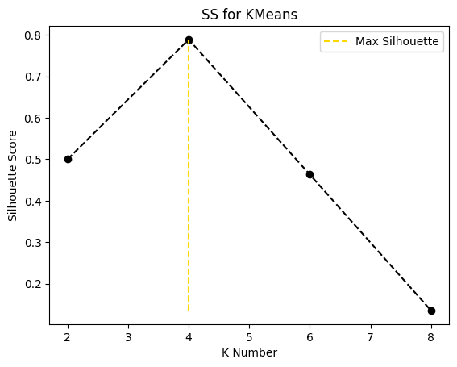
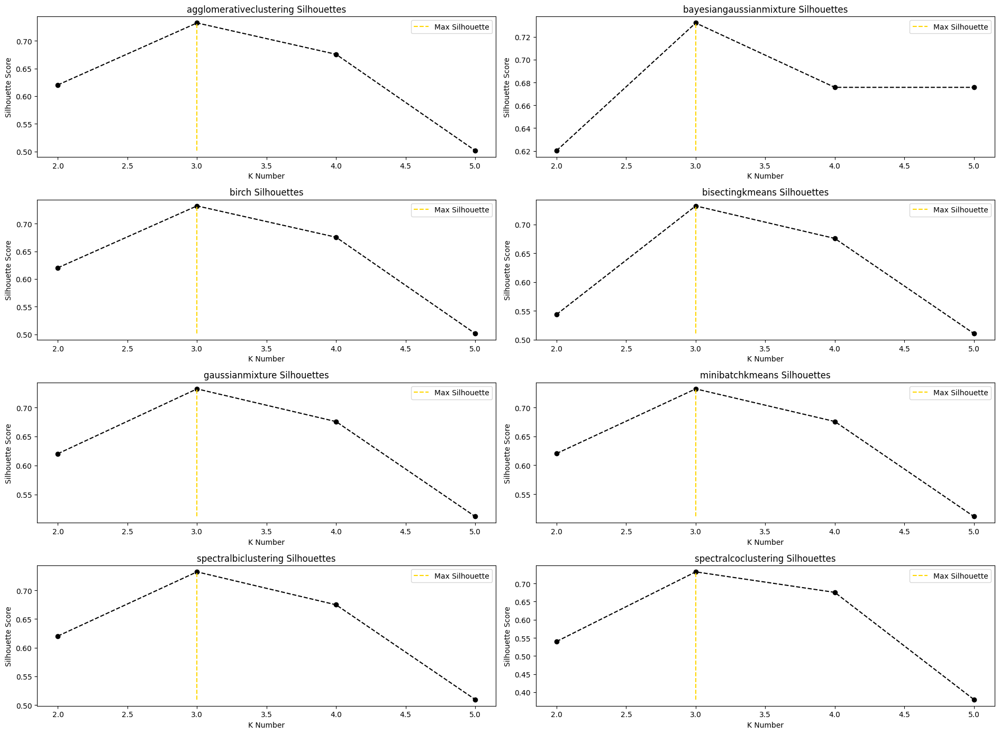
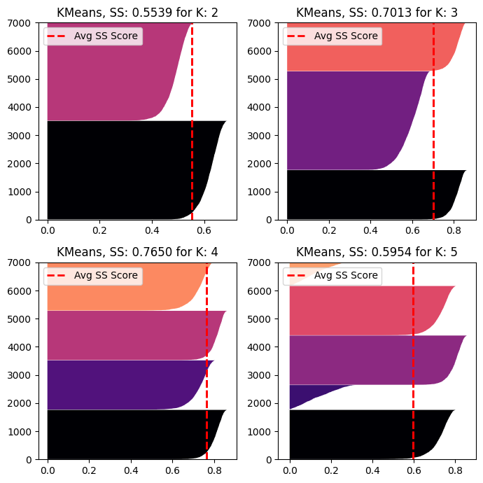

## `cluster-ss`: Cluster Silhouette Support

Clustering Problems is hard and much more hard in Python, do not exists some packages to faster implementation of metrics and others helpful supports like cluster analysis, visualization, estimators training and dimensionality reduction.
Note, This package was heavily influenced by the lazypredict package, I loved the ideia of one comand line for fit multiple estimators.

Based on this problems `cluster-ss` is a simple package to facilite implementation of this steps for clustering analysis, adding some simple ways to fit estimators and visualize one of my favorite metric, the *silhouette score*.

The package offers:

* Simple ways to visualize silhouette score and analysis.
* Fit functions from all sklearn cluster estimators.
* Setup multiple parameters to fit these estimators.

This is a simple study proposed package by Me, however I invite the community to contribute. Please help by trying it out, reporting bugs, making improvments and other cool thigs. :)

Link pypi: https://pypi.org/project/cluster-ss/

## Installation

```
pip install cluster-ss
```
For latest.

## Usage

### *Basic Silhouette Plots*

For basic plots, just prepare you dataset, select one sklearn base clustering estimators, a list of k clusters and use the `plot_silhouette` or `plot_silhouette_score`.

```python
import pandas as pd
from sklearn.cluster import KMeans
from sklearn.datasets import make_blobs

# Import the plot functions
from cluster_ss import plot_silhouette, plot_silhouette_score

# List of Clusters
cluster_list = [2, 4, 6, 8]

# Simple Random Blobs Dataset
X, y = make_blobs(n_samples=7_000, centers=4, n_features=5)

# A pandas Dataframe of Blobs dataset.
X = pd.DataFrame(X)

# Use the plot_silhouette
ax, fig = plot_silhouette(estimator=KMeans(), X=X, cluster_list=cluster_list)

```


You can also use `plot_silhouette_score` to get labels, scores and a plot at k cluster:

```python
# Labels at K is a list of dicts based on K cluster and respective labels
# Silhouette Scores at K is the Sklearn silhouette_score function result for X and labels.
labels_at_k, sil_scores_at_k, ax, fig = plot_silhouette_score(estimator=KMeans(), X=X, cluster_list=cluster_list)
```




<hr>


### *Multiple Sklearn Clustering Estimators Fits and Plots*

`ClusterSupport` supports "verbose" fitting results, "random_state" and "extra_parameters" for fitting the estimators.

```python
# You can import the class for multiple plots and setups.
from cluster_ss import ClusterSupport
cs = ClusterSupport(verbose=True)

# Using the same previous dataset and multiple silhouette scores plot.
# The 'estimators_selection' is the type of clustering estimators you like to use.
# 'all' -> Fit all estimators.
# 'k_inform' -> n_clusters or n_components params requested by some sklearn estimators.
# 'no_k_inform' -> Density based or similar sklearn estimators without specifying cluster number. 
fit_results, no_k_results, axes, fig = cs.plot_multiple_silhouette_score(X=X, cluster_list=cluster_list, estimators_selection='all')
```

Using `estimators_selection='all'` you get this plot:



The `fit_results` and `no_k_results` is a pandas dataframe with silhouettes scores for all estimators.


```python
# Using Aditional Parameters
# Just config a list or only one dict with Estimator name
# And a Dict with respective Estimator custom params.
extra_parameters = [
    {'KMeans': {'max_iter': 320,
                'tol': 0.001}},
    {'GaussianMixture': {'max_iter': 110,
                         'n_init': 2,
                         'reg_covar': 1e-05,
                         'tol': 0.01}}
]

# Select a list of estimators names 
# for skip setup and fitting
skipped = ["spectralcoclustering", "agglomerativeclustering", 
           "bayesiangaussianmixture", "dbscan", "optics", "birch"]

# A List of Clusters
cluster_list = [2, 3, 4, 5]

cs = ClusterSupport(
    verbose=True, 
    extra_parameters=extra_parameters, 
    skipped_estimators=skipped
)

axes, fig = cs.plot_multiple_silhouette(cluster_list=cluster_list, fit=True, X=X)

```

```
  0%|          | 0/4 [00:00<?, ?it/s]

Training: Estimator: kmeans -> K-Num: 2
Training: Estimator: minibatchkmeans -> K-Num: 2
Training: Estimator: gaussianmixture -> K-Num: 2
Training: Estimator: bisectingkmeans -> K-Num: 2
Training: Estimator: spectralclustering -> K-Num: 2
Training: Estimator: spectralbiclustering -> K-Num: 2

 25%|██▌       | 1/4 [00:14<00:43, 14.65s/it]
 
Training: Estimator: kmeans -> K-Num: 3
Training: Estimator: minibatchkmeans -> K-Num: 3
Training: Estimator: gaussianmixture -> K-Num: 3
Training: Estimator: bisectingkmeans -> K-Num: 3
Training: Estimator: spectralclustering -> K-Num: 3
Training: Estimator: spectralbiclustering -> K-Num: 3
...

```

One Example for one Fig generated by `plot_multiple_silhouette`.




```python
# You can use Fit too to get silhouettes for estimators_selection 'k_inform', 'no_k_inform' and 'all'
# This function return silhouettes scores for all estimators and a list with dicts inside sils_info_results. 
# This dict is just the results of fits.
# {estimator_name_k_number: (sklearn_silhouette_samples, labels)}
# {'Birch_2': (array([0.4647072, ..., 0.43923615]),
#              array([0, 1, 0, ..., 0, 0, 0]))
silhouettes, no_k_silhouettes, sils_info_results = cs.fit(X=X, cluster_list=cluster_list, estimators_selection='all')
```

The `silhouettes` variable is a pandas DataFrame of sklearn `silhouette_score` for all K clsuters in `cluster_list`:

index | 2 | 3 | 4 | 5 
----  | ---- | ---- | ---- | ---- 
bisectingkmeans | 0.661884 | 0.610811 | 0.688161 | 0.564153
gaussianmixture | 0.661884 | 0.610806 | 0.688178 | 0.548734
kmeans | 0.661884 | 0.610811 | 0.688178 | 0.556731
minibatchkmeans | 0.661884 | 0.610811 | 0.688178 | 0.512270
spectralbiclustering | 0.661884 | 0.415127 | 0.542108 | 0.557163
spectralclustering | 0.661884 | 0.610806 | 0.688178 | 0.559767


The `no_k_silhouettes` variable is a pandas DataFrame with sklearn `silhouette_score` for no k inform sklearn estimators.

index | Silhouette 
----  | ---- 
affinitypropagation | 0.121989
meanshift | 0.661884

Finally, the `sils_info_results` variable if a list of all fits with cluster labels and `silhouette_samples`.
For more details and a complete usage, please check examples folder.
**Thanks**!


## References

[1] [Lazypredict Package](https://pypi.org/project/lazypredict/): Lazy predict python package with similar implementation but for supervised learning.

[2] [Selecting the number of clusters with silhouette analysis on KMeans clustering](https://scikit-learn.org/stable/auto_examples/cluster/plot_kmeans_silhouette_analysis.html): scikit-learn post showing silhouette raw code analysis.
